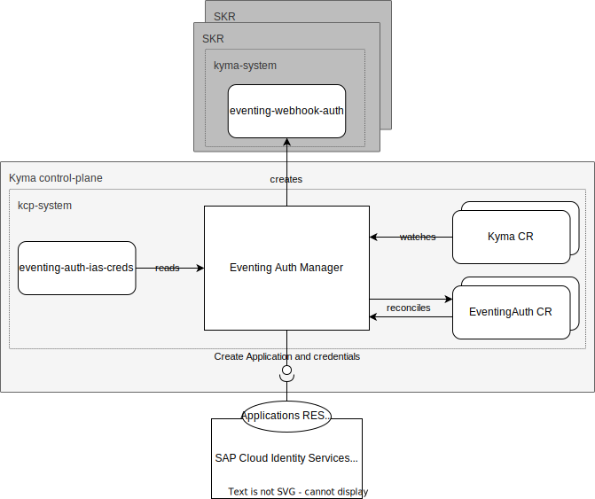
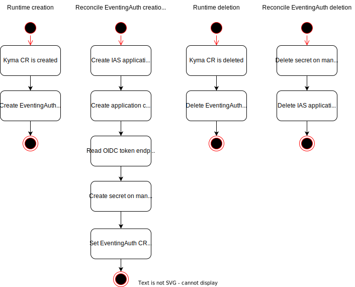

# Eventing Auth Manager
The eventing-auth-manager is a central component that is deployed on the [Kyma control-plane](https://github.com/kyma-project/control-plane). The component manages applications in the 
SAP Cloud Identity Services - Identity Authentication (IAS) by creating and deleting them based on creation or deletion of a managed Kyma Runtime.

### Table of contents
* [Description](#description)
* [EventingAuth CR](#eventingauth-cr)
* [eventing-webhook-auth secret](#eventing-webhook-auth-secret)
* [Name reference between resources](#name-reference-between-resources)
* [Resource Naming Constraints](#resource-naming-constraints)
* [Design decisions](#design-decisions)
* [Future improvements](#future-improvements)
* [Generating the SAP Cloud Identity Services API client](#generating-the-sap-cloud-identity-services-api-client)
* [Getting Started](#getting-started)
* [Contributing](#contributing)


## Description
The eventing-auth-manager manages the credentials for IAS applications used by webhooks in the `eventing` component.  
When a new managed Kyma Runtime is provisioned the component creates a new [OIDC](https://openid.net/connect/) IAS application for this runtime and stores the credentials in a secret on the new runtime.



A Kyma CR is created for each runtime. The Eventing Auth Manager watches the creation and deletion of Kyma CRs. On the creation of a Kyma CR, the Eventing Auth Manager creates an EventingAuth CR. 
The reconciliation of the EventingAuth CR will create an application in IAS using the [Application Directory REST API](https://api.sap.com/api/SCI_Application_Directory/) and the secret with the credentials on the managed runtime.
When the Kyma CR is deleted, the controller deletes the EventingAuth CR. On the deletion of the EventingAuth CR the Eventing Auth Manager deletes the application in IAS and the secret on the runtime.




## EventingAuth CR

For details, see the [specification file](./api/v1alpha1/eventingauth_types.go).

<!-- EventingAuth v1alpha1 operator.kyma-project.io -->
| Parameter                        | Description                                                                                                                               |
|----------------------------------|-------------------------------------------------------------------------------------------------------------------------------------------|
| **status.conditions**            | Conditions associated with EventingAuthStatus. There are conditions for creation of IAS application and the secret of the managed runtime |
| **status.iasApplication**        | Application contains information about a created IAS application                                                                          |
| **status.iasApplication.name**   | Name of the application in IAS                                                                                                            |
| **status.iasApplication.uuid**   | Application ID in IAS                                                                                                                     |
| **status.secret**                | AuthSecret contains information about created K8s secret                                                                                  |
| **status.secret.clusterId**      | Runtime ID of the cluster where the secret is created                                                                                     |
| **status.secret.namespacedName** | NamespacedName of the secret on the managed runtime                                                                                       |
| **status.state**                 | State signifies current state of CustomObject. Value can be one of ("Ready", "NotReady").                                                 |

## eventing-webhook-auth secret
The secret created on the managed runtime is looks like the following:
```yaml
apiVersion: v1
kind: Secret
metadata:
  name: eventing-webhook-auth
  namespace: kyma-system
type: Opaque
data:
  client_id: <client_id>
  client_secret: <client_secret>
  token_url: "https://<tenant>.accounts.ondemand.com/oauth2/token"
```

## Name reference between resources
The Kyma CR, which creation is the trigger for the creation of the EventingAuth CR, uses the unique runtime ID of the managed Kyma runtime as name. This name is used as the name for the EventingAuth CR and the IAS application. In this way, the EventingAuth CR and the IAS application can be assigned to the specific managed runtime.

## Resource Naming Constraints
The controller makes assumptions about the names used in the control plane cluster to read the correct resources. The assumptions are the following:
- The name of the Kyma CR is the unique runtime ID of the managed runtime.
- The name of the Kyma CR can be used to read the kubeconfig of the managed runtimes from a K8s secret with the name format `kubeconfig-<runtime-id>` in the "kcp-system" namespace.
- The IAS credentials are stored in a K8s secret named "eventing-auth-ias-creds" in the "kcp-system" namespace, and the data is stored in the following format:
  ```yaml
  apiVersion: v1
  kind: Secret
  metadata:
    name: eventing-auth-ias-creds
    namespace: kcp-system
  type: Opaque
  data:
    username: ias-user
    password: ias-password
    url: https://<tenant>.accounts.ondemand.com
  ```

## Design decisions

### Handling of Rate Limiting calling IAS API
We didn't implement any rate limit handling, because the [Rate Limiting documentation of IAS](https://help.sap.com/docs/IDENTITY_AUTHENTICATION/6d6d63354d1242d185ab4830fc04feb1/e22ee47abf614565bcb29bb4ddbbf209.html) mentions the following: 
> To ensure safe and stable environment, all requests have a limit of 50 concurrent requests per second. The requests are associated with the originating IP address, and not with the user making the requests.

Currently, we do not expect to exceed this rate limit since a reconciliation can perform a maximum of 5 sequential requests.  
There is also mention of a specific rate limit for SCIM endpoints, but we do not use these endpoints.

### Caching of well-known token endpoint
We read the known configuration of the IAS tenant that is used to create the applications to obtain the token endpoint. This token endpoint is then stored in the secret 
on the managed runtime along with the client ID and the client secret.  
The assumption is, that the token endpoint of the IAS tenant does not change without any notice of a breaking change.
To reduce the number of requests when creating an application client secret and thus increase the stability of the reconciliation, it was decided to cache the 
token endpoint on the first retrieval. The cached token endpoint is not invalidated during operator runtime, but is updated when the IAS credentials or tenant URL are changed.

### Referencing IAS applications by name
The IAS application is created with a name that matches the name of the EventingAuth CR. This name is the unique runtime ID of the cluster for which the IAS application is created.
Since we do not want to store the IAS application ID in the secret stored on the managed runtime , we can read the IAS application only by its name.  
During the creation of the application, existing applications with the same name are read. If an application with the same name exists, it is deleted, as we assume this is due to a failed reconciliation.
If more than one application with the same name already exists, the reconciliation fails. The same behaviour occurs when reconciling the deletion of the EventingAuth CR.

It was decided not to delete any of the existing applications in this case, as it is an unexpected condition that may have been caused by manual actions, and we may want to keep the applications to find the cause of the issue.

### Handling of failed IAS application and secret creation
If the creation of the IAS application fails, the reconciliation will be retried. If an application has already been created, it is deleted before creation is attempted again.
To avoid having multiple applications with the same name, the application is created again only if the deletion is successful.
During the application creation process, there are several steps that can fail. First, the application is created, then the client secret is created, and finally the client ID of the client secret is read.    
It was decided to always delete the application if any of these steps fail, as this makes the whole process more understandable and easier to maintain.  
The reason for this is that the existing application can only be reused if the reconciliation failed before the client secret was successfully created, as we have no way to retrieve the client secret the next time the reconciliation is performed. 

Additionally, if the creation of the secret on the managed runtime fails, we retrieve the created IAS application from the memory instead of recreating it in the IAS. 

## Future Improvements
- Identify IAS Application with its UUID. Currently, it is identified with its name, see [Referencing IAS applications by name](#referencing-ias-applications-by-name).
- Watch K8s secret in target runtime cluster so that it is reconciled in case deleted/modified.

## Generating the SAP Cloud Identity Services API client
The OpenAPI specification is available in the [API Business Hub](https://api.sap.com/api/SCI_Application_Directory).
The specification used to generate the client is stored in `internal/ias/internal/api/SCI_Application_Directory.yaml`.

To generate the client and client mocks from the specification, run the following command:

> NOTE: To generate the mocks you need to have [mockery](https://vektra.github.io/mockery/) installed.

```sh
make gen-ias-client
```

## Getting Started
You’ll need a Kubernetes cluster to run against. You can use [KIND](https://sigs.k8s.io/kind) to get a local cluster for testing, or run against a remote cluster.
**Note:** Your controller will automatically use the current context in your kubeconfig file (i.e. whatever cluster `kubectl cluster-info` shows).

### Preparing the clusters for local development
To run the controller locally, you need to have two clusters available. One cluster is used to run the controller, and the other cluster is used as a target for the created secret.

#### Prepare the cluster that is used to run the controller:

1. Create the namespace to deploy the manager and the IAS credential secret:

```sh
kubectl create ns kcp-system
```

2. Create the secret for the IAS credentials specified by `TEST_EVENTING_AUTH_IAS_USER`, `TEST_EVENTING_AUTH_IAS_PASSWORD` and `TEST_EVENTING_AUTH_IAS_URL`:

```sh
kubectl create secret generic eventing-auth-ias-creds -n kcp-system --from-literal=username=$TEST_EVENTING_AUTH_IAS_USER --from-literal=password=$TEST_EVENTING_AUTH_IAS_PASSWORD --from-literal=url=$TEST_EVENTING_AUTH_IAS_URL
```

3. Create the secret containing the kubeconfig of the cluster on which the "eventing-webhook-auth" secret is created by specifying `PATH_TO_TARGET_CLUSTER_KUBECONFIG` and `EVENTING_AUTH_CR_NAME`:

```sh
kubectl create secret generic kubeconfig-$EVENTING_AUTH_CR_NAME -n kcp-system --from-file=config=$PATH_TO_TARGET_CLUSTER_KUBECONFIG
```

#### Prepare the secret target cluster
Create the namespace in which the "eventing-webhook-auth" secret is created on the target cluster:

```sh
kubectl create ns kyma-system
```

### Running on the cluster
1. Update name of Custom Resource in `config/samples/eventing_v1alpha1_eventingauth.yaml` to contain the name of the kubeconfig secret created in [Preparing the clusters](#preparing-the-clusters).

2. Install Instances of Custom Resources:

```sh
kubectl apply -f config/samples/
```

3. Build and push your image to the location specified by `IMG`:

```sh
make docker-build docker-push IMG=<some-registry>/eventing-auth-manager:tag
```

4. Deploy the controller to the cluster with the image specified by `IMG`:

```sh
make deploy IMG=<some-registry>/eventing-auth-manager:tag
```

### Uninstall CRDs
To delete the CRDs from the cluster:

```sh
make uninstall
```

### Undeploy controller
UnDeploy the controller from the cluster:

```sh
make undeploy
```

### Configuring integration tests
The tests can be executed by running the following command:

```sh
make test
```

#### IAS stub
Per default the integration tests use a stub for the IAS API. This stub will return 
It's also possible to use the real IAS API by setting all the following environment variables:

```sh
export TEST_EVENTING_AUTH_IAS_URL=https://my-tenant.accounts.ondemand.com
export TEST_EVENTING_AUTH_IAS_USER=user@sap.com
export TEST_EVENTING_AUTH_IAS_PASSWORD=password
```

#### Target Cluster
Per default the integration tests use a local control plane created by [envtest](https://pkg.go.dev/sigs.k8s.io/controller-runtime/pkg/envtest).
It's also possible to use a real target cluster by setting following environment variable:

```sh
# The path to the kubeconfig of the cluster
export TEST_EVENTING_AUTH_TARGET_KUBECONFIG_PATH=/some/path/.kube/config
```

## Contributing

### How it works
This project aims to follow the Kubernetes [Operator pattern](https://kubernetes.io/docs/concepts/extend-kubernetes/operator/).

It uses [Controllers](https://kubernetes.io/docs/concepts/architecture/controller/),
which provide a reconcile function responsible for synchronizing resources until the desired state is reached on the cluster.

### Test It Out
1. Install the CRDs into the cluster:

```sh
make install
```

2. Run your controller (this will run in the foreground, so switch to a new terminal if you want to leave it running):

```sh
make run
```

**NOTE:** You can also run this in one step by running: `make install run`

### Modifying the API definitions
If you are editing the API definitions, generate the manifests such as CRs or CRDs using:

```sh
make manifests
```

**NOTE:** Run `make --help` for more information on all potential `make` targets

More information can be found via the [Kubebuilder Documentation](https://book.kubebuilder.io/introduction.html)
