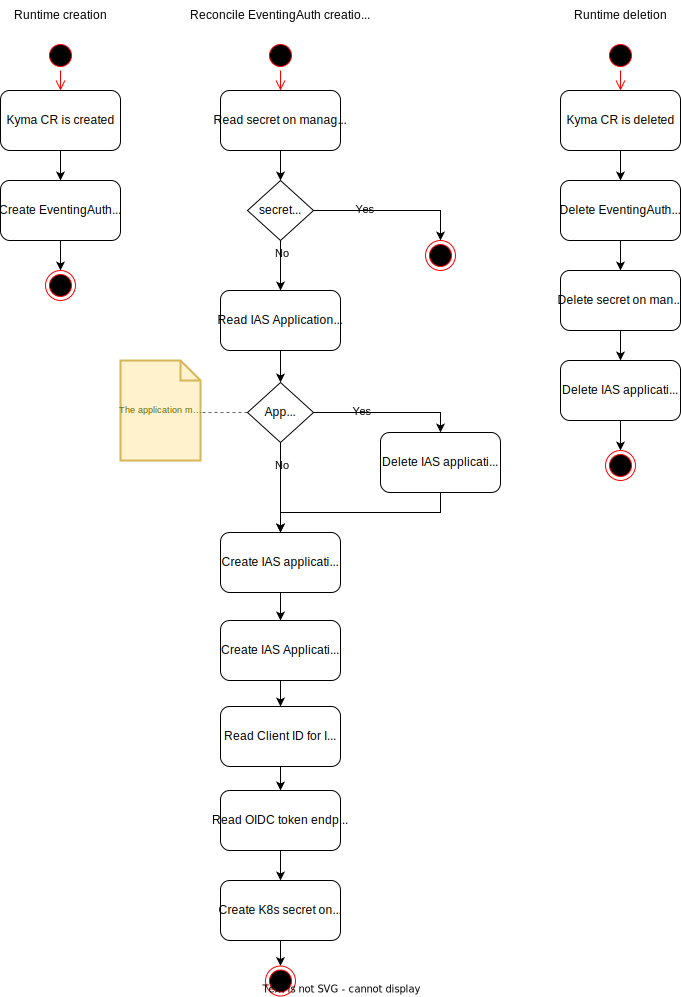

# Eventing Auth Manager
The eventing-auth-manager is a central component that is deployed on the [Kyma control-plane](https://github.com/kyma-project/control-plane). The component manages applications in the 
SAP Cloud Identity Services - Identity Authentication (IAS) by creating and deleting them based on creation or deletion of a managed Kyma Runtime.

## Description
The eventing-auth-manager manages the credentials for IAS applications used by webhooks in the `eventing` component.  
When a new managed Kyma Runtime is provisioned the component creates a new [OIDC](https://openid.net/connect/) IAS application for this runtime and stores the credentials in a secret on the new runtime.


A Kyma CR is created for each runtime. The eventing-auth-manager watches the creation and deletion of Kyma CRs. When a Kyma CR is created, the controller creates an EventingAuth CR. 
The reconciliation of the EventingAuth CR will create an application in the IAS and the secret with the credentials on the runtime.
When the Kyma CR is deleted, the controller deletes the application in the IAS, the secret on the runtime, and the EventingAuth CR.




### EventingAuth CR

For details, see the [specification file](./api/v1alpha1/eventingauth_types.go).

<!-- EventingAuth v1alpha1 operator.kyma-project.io -->
| Parameter         | Description                                                                                                                               |
| ---------------------------------------- |-------------------------------------------------------------------------------------------------------------------------------------------|
| **status.conditions** | Conditions associated with EventingAuthStatus. There are conditions for creation of IAS application and the secret of the managed runtime |
| **status.iasApplication** | Application contains information about a created IAS application                                                                          |
| **status.iasApplication.name** | Name of the application in IAS                                                                                                            |
| **status.iasApplication.uuid** | Application ID in IAS                                                                                                                     |
| **status.secret** | AuthSecret contains information about created K8s secret                                                                                  |
| **status.secret.cluster** | Runtime ID of the cluster where the secret is created                                                                                     |
| **status.secret.namespacedName** | NamespacedName of the secret on the managed runtime                                                                                       |
| **status.state** | State signifies current state of CustomObject. Value can be one of ("Ready", "NotReady").                                                 |

### eventing-webhook-auth secret
The secret created on the managed runtime is looks like the following:
```yaml
apiVersion: v1
kind: Secret
metadata:
  name: eventing-webhook-auth
  namespace: kyma-system
type: Opaque
data:
  client_id: "850d10a4-6e0b-4958-8232-066962ed3b46"
  client_secret: "h?VTJMDxj0Trn8t=yE55gW_dsJgXR[df3IQ"
  token_url: "https://<tenant>.accounts400.ondemand.com/oauth2/token"
```

### Reference between resources
The Kyma CR, which creation is the trigger for the creation of the EventingAuth CR, uses the unqiue runtime ID of the managed Kyma runtime as name. This name is used as the name for the
name for the EventingAuth CR and the IAS application. In this way, the eventing-auth CR and the IAS application can be assigned to the specific managed runtime.

### Design decisions

#### Handling of Rate Limiting calling IAS API
We didn't implement any rate limit handling, because the [Rate Limiting documentation of IAS](https://help.sap.com/docs/IDENTITY_AUTHENTICATION/6d6d63354d1242d185ab4830fc04feb1/e22ee47abf614565bcb29bb4ddbbf209.html) mentions the following: 
> To ensure safe and stable environment, all requests have a limit of 50 concurrent requests per second. The requests are associated with the originating IP address, and not with the user making the requests.

Currently, we do not expect to exceed this rate limit since a reconciliation can perform a maximum of 5 sequential requests.  
There is also mention of a specific rate limit for SCIM endpoints, but we do not use these endpoints.

#### Caching of well-known token endpoint
We read the known configuration of the IAS tenant that is used to create the applications to obtain the token endpoint. This token endpoint is then stored in the secret 
on the managed runtime along with the Client ID and the Client Secret.  
The assumption is, that the token endpoint of the IAS tenant does not change without any notice of a breaking change.
To reduce the number of requests when creating an application secret and thus increase the stability of the reconciliation, it was decided to cache the 
token endpoint on the first retrieval. The cached token endpoint is not invalidated and is available during the runtime of the operator.

#### Referencing IAS applications by name
The IAS application is created with a name that matches the name of the EventingAuth CR. This name is the unique runtime ID of the cluster for which the IAS application is created.
Since we do not want to store the IAS application ID in the managed runtime secret, we can read the IAS application only by its name.  
During the creation of the application, existing applications with the same name are read. If an application with the same name exists, it is deleted, as we assume this is due to a failed reconciliation.
If more than one application with the same name already exists, the reconciliation fails. The same behaviour occurs when reconciling the deletion of the EventingAuth CR.

It was decided not to delete any of the existing applications in this case, as it is an unexpected condition that may have been caused by manual actions, and we may want to keep the applications to find the cause of the issue.

#### Handling of failed IAS application creation
If the creation of the IAS application fails, the reconciliation will be retried. If an application has already been created, it is deleted before creation is attempted again.
To avoid having multiple applications with the same name, the application is created again only if the deletion is successful.
During the application creation process, there are several steps that can fail. First, the application is created, then the client secret is created, and finally the client ID of the client secret is read.    
It was decided to always delete the application if any of these steps fail, as this makes the whole process more understandable and easier to maintain.  
The reason for this is that the existing application can only be reused if the reconciliation failed before the client secret was successfully created, as we have no way to retrieve the client secret the next time the reconciliation is performed.  
There is still the option of not always deleting the application by caching the created client secrets in the operator, but caching the client secrets might not be a good idea for security reasons either.

## Generating the SAP Cloud Identity Services API client
The OpenAPI specification is available in the [API Business Hub](https://api.sap.com/api/SCI_Application_Directory).
The specification used to generate the client is stored in `internal/ias/internal/SCI_Application_Directory.yaml`.

To generate the client and client mocks from the specification, run the following command:

> NOTE: To generate the mocks you need to have [mockery](https://vektra.github.io/mockery/) installed.

```sh
make gen-ias-client
```

## Getting Started
You’ll need a Kubernetes cluster to run against. You can use [KIND](https://sigs.k8s.io/kind) to get a local cluster for testing, or run against a remote cluster.
**Note:** Your controller will automatically use the current context in your kubeconfig file (i.e. whatever cluster `kubectl cluster-info` shows).

### Running on the cluster
1. Install Instances of Custom Resources:

```sh
kubectl apply -f config/samples/
```

2. Build and push your image to the location specified by `IMG`:

```sh
make docker-build docker-push IMG=<some-registry>/eventing-auth-manager:tag
```

3. Deploy the controller to the cluster with the image specified by `IMG`:

```sh
make deploy IMG=<some-registry>/eventing-auth-manager:tag
```

### Uninstall CRDs
To delete the CRDs from the cluster:

```sh
make uninstall
```

### Undeploy controller
UnDeploy the controller from the cluster:

```sh
make undeploy
```

## Contributing
// TODO(user): Add detailed information on how you would like others to contribute to this project

### How it works
This project aims to follow the Kubernetes [Operator pattern](https://kubernetes.io/docs/concepts/extend-kubernetes/operator/).

It uses [Controllers](https://kubernetes.io/docs/concepts/architecture/controller/),
which provide a reconcile function responsible for synchronizing resources until the desired state is reached on the cluster.

### Test It Out
1. Install the CRDs into the cluster:

```sh
make install
```

2. Run your controller (this will run in the foreground, so switch to a new terminal if you want to leave it running):

```sh
make run
```

**NOTE:** You can also run this in one step by running: `make install run`

### Modifying the API definitions
If you are editing the API definitions, generate the manifests such as CRs or CRDs using:

```sh
make manifests
```

**NOTE:** Run `make --help` for more information on all potential `make` targets

More information can be found via the [Kubebuilder Documentation](https://book.kubebuilder.io/introduction.html)
