# Eventing Auth Manager

Eventing Auth Manager is a central component that is deployed in Kyma Control Plane. The component manages applications in the SAP Cloud Identity Services - Identity Authentication (IAS) by creating and deleting them based on the creation or deletion of a managed Kyma runtime.

## Architecture

Eventing Auth Manager manages the credentials for IAS applications used by webhooks in the `eventing` component. When a new managed Kyma runtime is provisioned, the component creates a new [OIDC](https://openid.net/connect/) IAS application for this runtime and stores the credentials in a Secret on the new runtime.



A Kyma custom resource (CR) is created for each runtime. Eventing Auth Manager watches the creation and deletion of Kyma CRs. Once a Kyma CR is created, the Eventing Auth Manager creates an EventingAuth CR.

The reconciliation of the EventingAuth CR creates an application in IAS using the [Application Directory REST API](https://api.sap.com/api/SCI_Application_Directory/) and the Secret with the credentials on the managed runtime.

When the Kyma CR is deleted, the controller deletes the EventingAuth CR. Once the EventingAuth CR is deleted, the Eventing Auth Manager deletes the application in IAS and the Secret in the runtime.



## EventingAuth Custom Resource

For more information, see the [specification file](https://github.com/kyma-project/eventing-auth-manager/blob/main/api/v1alpha1/eventingauth_types.go).

<!-- EventingAuth v1alpha1 operator.kyma-project.io -->
| Parameter                        | Description                                                                                                                               |
|----------------------------------|-------------------------------------------------------------------------------------------------------------------------------------------|
| **status.conditions**            | Conditions associated with EventingAuthStatus. There are conditions for the creation of IAS application and the Secret of the managed runtime |
| **status.iasApplication**        | Application contains information about a created IAS application                                                                          |
| **status.iasApplication.name**   | Name of the application in IAS                                                                                                            |
| **status.iasApplication.uuid**   | Application ID in IAS                                                                                                                     |
| **status.secret**                | AuthSecret contains information about created K8s secret                                                                                  |
| **status.secret.clusterId**      | Runtime ID of the cluster where the Secret is created                                                                                     |
| **status.secret.namespacedName** | NamespacedName of the Secret on the managed runtime                                                                                       |
| **status.state**                 | State signifies the current state of CustomObject. Value can be one of (`Ready`, `NotReady`).                                                 |

### `eventing-webhook-auth` Secret

The Secret created on the managed runtime looks following:

```yaml
apiVersion: v1
kind: Secret
metadata:
  name: eventing-webhook-auth
  namespace: kyma-system
type: Opaque
data:
  client_id: <client_id>
  client_secret: <client_secret>
  token_url: "https://<tenant>.accounts.ondemand.com/oauth2/token"
  certs_url: "https://<tenant>.accounts.ondemand.com/oauth2/certs"
```

### Name References Between Resources

The Kyma CR, whose creation is the trigger for the creation of the EventingAuth CR, uses the unique runtime ID of the managed Kyma runtime as the name. This name is also used as the name for the EventingAuth CR and the IAS application. In this way, the EventingAuth CR and the IAS application can be assigned to the specific managed runtime.

### Resource Naming Constraints

The controller makes assumptions about the names used in the control plane cluster to read the correct resources. The assumptions are the following:
- The name of the Kyma CR is the unique runtime ID of the managed runtime.
- The name of the Kyma CR can be used to read the kubeconfig of the managed runtimes from a Kubernetes Secret with the name format `kubeconfig-<runtime-id>` in the "kcp-system" namespace.
- The IAS credentials are stored in a Kubernetes Secret named "eventing-auth-ias-creds" in the "kcp-system" namespace, and the data is stored in the following format:

  ```yaml
  apiVersion: v1
  kind: Secret
  metadata:
    name: eventing-auth-ias-creds
    namespace: kcp-system
  type: Opaque
  data:
    username: ias-user
    password: ias-password
    url: https://<tenant>.accounts.ondemand.com
  ```

## Generating the SAP Cloud Identity Services API Client

The OpenAPI specification is available in the [API Business Hub](https://api.sap.com/api/SCI_Application_Directory).

The specification used to generate the client is stored in `internal/ias/internal/api/SCI_Application_Directory.yaml`.

To generate the client and client mocks from the specification, run the following command:

> ### Note
> To generate the mocks, you must install [mockery](https://vektra.github.io/mockery/).

```sh
make gen-ias-client
```
